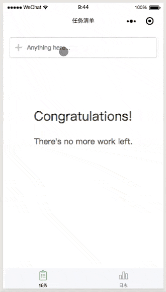

# Wechat App TODOS

> 又一个“待办事项”微信小程序

> yet another wechat todos weapp with mpvue 

## Original

初学前端，使用了 https://github.com/zce/weapp-todos 项目的样式和资源，采用mpvue、Typescript编写，适合新手

## Preview

## License 

[MIT](LICENSE)

## How To Run

  yarn 

  yarn start

或者 

  npm install 

  npm run dev

用微信开发者工具指向项目根目录

